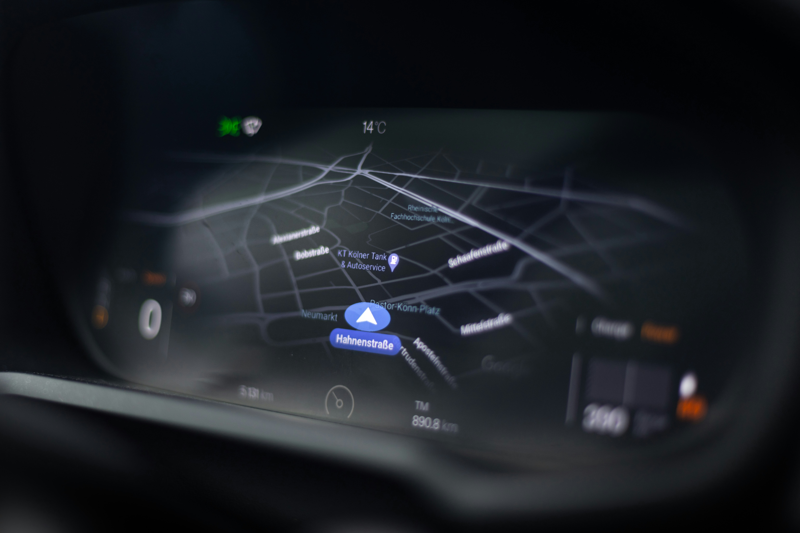

<div align="center">
  
  
  #  NexRide
  
  ### Next-Generation AI-Powered Ride-Hailing Platform
  
  <p align="center">
    <strong>A modern, full-stack SaaS solution for ride-sharing services with real-time tracking, AI-powered chat, and comprehensive admin controls</strong>
  </p>

 [](https://nexride-hire.vercel.app)
[](https://nextjs.org/)
[](https://www.typescriptlang.org/)
[](https://www.mongodb.com/)
[](https://reactjs.org/)
[](LICENSE)

  <p align="center">
    <a href="#-features">Features</a> •
    <a href="#-tech-stack">Tech Stack</a> •
    <a href="#-getting-started">Getting Started</a> •
    <a href="#-architecture">Architecture</a> •
    <a href="#-api-documentation">API</a> •
    <a href="#-contributing">Contributing</a>
  </p>

  

</div>

---

## 🌟 Features

### 🤖 AI-Powered Intelligence
- **Smart Chat Suggestions**: Context-aware AI-powered quick replies using Groq SDK (GPT-120B)
- **Intelligent Message Generation**: Real-time conversation analysis for relevant response suggestions
- **Adaptive Communication**: Role-based AI assistance for both drivers and passengers

### 👥 Multi-Role Architecture
- **🚕 Partner Dashboard**: Complete driver management with onboarding, earnings tracking, and ride management
- **👤 Customer Portal**: Intuitive booking interface with real-time tracking and payment options
- **🛡️ Admin Control Center**: Comprehensive oversight with KYC verification, analytics, and platform management

### 🗺️ Real-Time Geolocation & Mapping
- **Live GPS Tracking**: Real-time vehicle location updates using Socket.IO
- **Interactive Maps**: Powered by Leaflet.js with route optimization
- **Smart Routing**: OSRM integration for optimal route calculation
- **Geocoding & Reverse Geocoding**: Photon API integration for address lookup

### 💬 Advanced Communication
- **Real-Time Chat**: WebSocket-powered instant messaging between drivers and passengers
- **Message History**: Persistent conversation storage with MongoDB
- **Read Receipts**: Message delivery and read status tracking
- **AI Suggestions**: Context-aware quick replies for faster communication

### 💳 Payment Gateway Integration
- **Stripe Integration**: Secure card payments with automatic checkout sessions
- **Cash on Delivery**: Flexible payment options
- **Payment Tracking**: Comprehensive transaction history and status management

### 📊 Business Intelligence
- **Analytics Dashboard**: Real-time metrics with Recharts visualization
- **Revenue Tracking**: Platform earnings, partner payouts, and commission management
- **KPI Monitoring**: Total rides, completion rates, and customer metrics
- **Partner Performance**: Earnings breakdown and ride statistics

### 🔐 Security & Authentication
- **NextAuth.js Integration**: Secure authentication with multiple providers
- **Google OAuth**: Social login for seamless onboarding
- **Email Verification**: OTP-based email confirmation via Nodemailer
- **Role-Based Access Control**: Granular permissions for users, partners, and admins

### 📱 Partner Onboarding & KYC
- **8-Step Verification Process**: Comprehensive partner onboarding
- **Document Upload**: Cloudinary-powered secure file storage
- **KYC Verification**: Manual review system with rejection reasons
- **Bank Details**: Secure storage of payout information
- **Vehicle Verification**: Multi-vehicle type support (Car, Bike, Auto, Truck, Loader)

### 🎨 Modern UI/UX
- **Fully Responsive Design**: Mobile-first approach with Tailwind CSS 4.0
- **Glassmorphism Effects**: Modern UI with backdrop blur and transparency
- **Framer Motion Animations**: Smooth transitions and micro-interactions
- **Dark Theme**: Eye-friendly dark mode with custom color palette

### 🔔 Notification System
- **Email Notifications**: Transactional emails for bookings, payments, and verifications
- **Real-Time Updates**: Live status changes via WebSockets
- **Push Notifications**: Browser notifications for new ride requests (future)

---

## 🛠️ Tech Stack

### **Frontend**
```typescript
⚡ Next.js 16.2          // React framework with App Router
🎨 Tailwind CSS 4.0      // Utility-first CSS framework
🌀 Framer Motion 12.40   // Animation library
🗺️ Leaflet 1.9.4         // Interactive maps
📊 Recharts 3.8          // Chart visualization
🎭 Lucide React 1.17     // Icon library
🔄 Redux Toolkit 2.12    // State management
```

### **Backend**
```typescript
🚀 Next.js API Routes    // Serverless API endpoints
🍃 MongoDB 9.6           // NoSQL database
🔐 NextAuth.js 5.0       // Authentication
📧 Nodemailer 7.0        // Email service
☁️ Cloudinary 2.10       // Media management
💳 Stripe 22.2           // Payment processing
```

### **AI & Real-Time**
```typescript
🤖 Groq SDK 1.2          // AI-powered chat (GPT-120B)
⚡ Socket.IO 4.8         // WebSocket real-time communication
🎥 ZegoCloud 2.17        // Video KYC (future)
```

### **Maps & Geocoding**
```typescript
🗺️ OSRM API              // Route optimization
📍 Photon API            // Geocoding service
🌍 OpenStreetMap         // Map tiles
```

### **DevOps & Tools**
```typescript
📦 TypeScript 5.0        // Type safety
🧪 ESLint 9.0            // Code linting
🎯 Git & GitHub          // Version control
```

---

## 🚀 Getting Started

### Prerequisites
- **Node.js** 20.x or higher
- **MongoDB** 7.0+ (Atlas or local)
- **Git** for version control
- **npm** or **yarn** package manager

### Environment Variables

Create a `.env.local` file in the root directory:

```env
# Database
MONGODB_URL=mongodb+srv://your-mongodb-url
MONGODB_DB=nexride

# Authentication
AUTH_SECRET=your-nextauth-secret-key
NEXTAUTH_URL=http://localhost:3000

# Google OAuth
GOOGLE_CLIENT_ID=your-google-client-id
GOOGLE_CLIENT_SECRET=your-google-client-secret

# Email Service (Gmail)
EMAIL=your-email@gmail.com
PASS=your-app-specific-password

# Payment Gateways
STRIPE_SECRET_KEY=sk_test_your-stripe-secret-key
STRIPE_WEBHOOK_SECRET=whsec_your-webhook-secret

SAFEPAY_API_KEY=your-safepay-api-key
SAFEPAY_ENVIRONMENT=sandbox # or 'production'

# AI Service
GROQ_API_KEY=your-groq-api-key

# Cloudinary
CLOUDINARY_CLOUD_NAME=your-cloud-name
CLOUDINARY_API_KEY=your-api-key
CLOUDINARY_API_SECRET=your-api-secret

# App Configuration
NEXT_PUBLIC_APP_URL=http://localhost:3000
NEXT_PUBLIC_SOCKET_SERVER_URL=http://localhost:3000
```

### Installation

```bash
# Clone the repository
git clone https://github.com/yourusername/nexride.git
cd nexride

# Install dependencies
npm install
# or
yarn install

# Run development server
npm run dev
# or
yarn dev
```

Open [http://localhost:3000](http://localhost:3000) to see the application.

### Build for Production

```bash
# Create optimized production build
npm run build

# Start production server
npm start
```

---

## 📁 Project Structure

```
nexride/
├── src/
│   ├── app/                      # Next.js App Router
│   │   ├── api/                  # API routes
│   │   │   ├── auth/             # Authentication endpoints
│   │   │   ├── bookings/         # Booking management
│   │   │   ├── messages/         # Chat & AI suggestions
│   │   │   ├── payments/         # Payment processing
│   │   │   ├── partner/          # Partner operations
│   │   │   ├── admin/            # Admin functions
│   │   │   └── vehicles/         # Vehicle management
│   │   ├── user/                 # Customer pages
│   │   ├── partner/              # Driver pages
│   │   ├── admin/                # Admin pages
│   │   └── page.tsx              # Landing page
│   ├── components/               # React components
│   │   ├── chat/                 # Chat components
│   │   ├── AdminDashboard.tsx
│   │   ├── PartnerDashboard.tsx
│   │   ├── Nav.tsx
│   │   └── ...
│   ├── models/                   # Mongoose schemas
│   │   ├── user.model.ts
│   │   ├── booking.model.ts
│   │   ├── message.model.ts
│   │   └── vehicles.model.ts
│   ├── lib/                      # Utility libraries
│   │   ├── db.ts                 # MongoDB connection
│   │   ├── stripe.ts             # Stripe integration
│   │   ├── safepay.ts            # Safepay integration
│   │   ├── cloudinary.ts         # Media upload
│   │   ├── socket.ts             # Socket.IO client
│   │   ├── geo.ts                # Geolocation utils
│   │   ├── routing.ts            # Route calculation
│   │   └── photon.ts             # Geocoding
│   ├── redux/                    # Redux store
│   │   ├── store.ts
│   │   └── userSlice.ts
│   ├── types/                    # TypeScript types
│   ├── hooks/                    # Custom React hooks
│   └── auth.ts                   # NextAuth configuration
├── public/                       # Static assets
├── .env.local                    # Environment variables
├── next.config.ts                # Next.js configuration
├── tailwind.config.ts            # Tailwind configuration
└── package.json                  # Dependencies
```

---

## 🏗️ Architecture

### System Architecture

```
┌─────────────────────────────────────────────────────────────┐
│                       Client Layer                          │
│  ┌──────────────┐  ┌──────────────┐  ┌──────────────┐     │
│  │   Customer   │  │   Partner    │  │    Admin     │     │
│  │   Portal     │  │  Dashboard   │  │   Console    │     │
│  └──────────────┘  └──────────────┘  └──────────────┘     │
└─────────────────────────────────────────────────────────────┘
                           │
                           ▼
┌─────────────────────────────────────────────────────────────┐
│                    Next.js App Router                       │
│  ┌─────────────────────────────────────────────────────┐   │
│  │           Server-Side Rendering (SSR)                │   │
│  │           API Routes (Serverless Functions)          │   │
│  └─────────────────────────────────────────────────────┘   │
└─────────────────────────────────────────────────────────────┘
                           │
           ┌───────────────┼───────────────┐
           ▼               ▼               ▼
    ┌──────────┐    ┌──────────┐   ┌──────────┐
    │ MongoDB  │    │ Socket.IO│   │   Groq   │
    │ Database │    │ WebSocket│   │ AI API   │
    └──────────┘    └──────────┘   └──────────┘
           │               │               │
           └───────────────┼───────────────┘
                           ▼
           ┌───────────────────────────────┐
           │    External Services          │
           ├───────────────────────────────┤
           │  • Stripe Payment             │
           │  • Safepay Gateway            │
           │  • Cloudinary CDN             │
           │  • OpenStreetMap / OSRM       │
           │  • Photon Geocoding           │
           │  • Gmail SMTP                 │
           └───────────────────────────────┘
```

### Database Schema

#### User Model
```typescript
{
  name: string
  email: string
  password: string (hashed)
  role: 'user' | 'partner' | 'admin'
  isEmailVerified: boolean
  isPartnerVerified: boolean
  partnerOnboardingSteps: number
  location: { type: 'Point', coordinates: [lng, lat] }
  isOnline: boolean
  vehicles: ObjectId[]
  documents: ObjectId[]
  bankDetails: ObjectId
}
```

#### Booking Model
```typescript
{
  user: ObjectId
  partner: ObjectId
  pickup: { label: string, coordinates: [lng, lat] }
  dropoff: { label: string, coordinates: [lng, lat] }
  vehicleType: 'car' | 'bike' | 'auto' | 'loading' | 'truck'
  status: 'requested' | 'confirmed' | 'started' | 'completed' | 'cancelled'
  paymentMethod: 'cash' | 'card'
  paymentStatus: 'pending' | 'paid' | 'cash' | 'failed'
  estimatedFare: number
  totalFare: number
  platformFee: number
  partnerEarning: number
  distanceKm: number
  durationMin: number
}
```

#### Message Model
```typescript
{
  booking: ObjectId
  sender: ObjectId
  senderRole: 'user' | 'partner'
  content: string
  isAiSuggestion: boolean
  read: boolean
  createdAt: Date
}
```

---

## 🔌 API Documentation

### Authentication

#### POST `/api/auth/register`
Register a new user
```json
{
  "name": "John Doe",
  "email": "john@example.com",
  "password": "securePassword123"
}
```

#### POST `/api/auth/verify-email`
Verify email with OTP
```json
{
  "email": "john@example.com",
  "otp": "123456"
}
```

### Bookings

#### POST `/api/bookings`
Create a new ride booking
```json
{
  "pickup": {
    "label": "Liberty Market, Lahore",
    "coordinates": [74.3587, 31.5497]
  },
  "dropoff": {
    "label": "Mall Road, Lahore",
    "coordinates": [74.3436, 31.5656]
  },
  "vehicleType": "car",
  "passengerPhone": "+923001234567",
  "paymentMethod": "card",
  "partnerId": "partner-id",
  "estimatedFare": 500
}
```

#### GET `/api/bookings?status=confirmed`
Get bookings by status

#### PATCH `/api/bookings/[id]`
Update booking status
```json
{
  "status": "started"
}
```

### Messages & AI

#### POST `/api/messages`
Send a message
```json
{
  "bookingId": "booking-id",
  "content": "I'm on my way!",
  "senderRole": "partner"
}
```

#### POST `/api/messages/suggest`
Get AI-powered message suggestions
```json
{
  "bookingId": "booking-id",
  "userRole": "partner"
}
```
**Response:**
```json
{
  "success": true,
  "suggestions": [
    "I'm 2 minutes away",
    "Waiting at the pickup point",
    "Traffic is heavy, running late",
    "Can you share your exact location?"
  ]
}
```

### Partner

#### GET `/api/vehicles/nearby`
Find available partners near location
```typescript
GET /api/vehicles/nearby?lat=31.5497&lng=74.3587&radius=5&vehicleType=car
```

#### POST `/api/partner/location`
Update partner's GPS location
```json
{
  "lat": 31.5497,
  "lng": 74.3587
}
```

### Payments

#### POST `/api/payments/stripe/checkout`
Create Stripe checkout session
```json
{
  "bookingId": "booking-id"
}
```

#### POST `/api/payments/safepay/init`
Initialize Safepay payment
```json
{
  "bookingId": "booking-id"
}
```

---

## 🎯 Key Features Deep Dive

### 🤖 AI-Powered Chat Suggestions

NexRide uses **Groq's GPT-120B model** to provide intelligent, context-aware message suggestions:

**How it works:**
1. **Context Analysis**: Fetches recent 10 messages from the conversation
2. **Role Detection**: Identifies whether user is driver or passenger
3. **Situational Awareness**: Considers ride status (confirmed, started, completed)
4. **Smart Generation**: Generates 4 contextual quick-reply suggestions
5. **Fallback Handling**: Provides default suggestions if AI service fails

**Example Scenarios:**
- **Driver waiting**: "I've arrived at the pickup location", "I'm waiting near the entrance"
- **Traffic delay**: "Running 5 minutes late due to traffic", "Heavy traffic on route"
- **Passenger query**: "I'm at the pickup point", "How far away are you?"

### 🗺️ Real-Time GPS Tracking

**Technology Stack:**
- **Socket.IO**: WebSocket connections for live updates
- **MongoDB Geospatial Queries**: Efficient radius-based partner discovery
- **Leaflet.js**: Interactive map rendering with custom markers
- **OSRM**: Open-source routing machine for optimal routes

**Features:**
- Live partner location updates every 5 seconds
- Radius-based partner discovery (0.5km - 50km)
- Route polyline display with pickup/dropoff markers
- Distance and ETA calculations

### 💳 Dual Payment Gateway

**Stripe Integration:**
- International card payments
- Automatic checkout session creation
- Webhook handling for payment status
- Secure payment processing with 3D Secure

**Safepay Integration:**
- Local Pakistani payment gateway
- Support for JazzCash, EasyPaisa, bank transfers
- Sandbox and production environments
- Webhook handling for payment confirmation

### 📊 Admin Analytics Dashboard

**Metrics Tracked:**
- Total partners (approved, pending, rejected)
- Total rides (completed, cancelled, active)
- Revenue breakdown (platform earnings, partner payouts)
- Customer statistics
- Partner performance metrics

**Visualizations:**
- Pie charts for partner distribution
- Bar charts for ride statistics
- KPI cards with real-time updates
- Recent bookings table with filters

---

## 🧪 Testing

### Running Tests (Coming Soon)
```bash
# Unit tests
npm test

# E2E tests
npm run test:e2e

# Coverage
npm run test:coverage
```

### Manual Testing Checklist
- [ ] User registration and email verification
- [ ] Partner onboarding (8 steps)
- [ ] Ride booking flow
- [ ] Real-time GPS tracking
- [ ] Chat with AI suggestions
- [ ] Payment processing (Stripe + Safepay)
- [ ] Admin KYC approval
- [ ] Ride completion and earnings

---

## 🚀 Deployment

### Vercel (Recommended)

[](https://vercel.com/new/clone?repository-url=https://github.com/yourusername/nexride)

```bash
# Install Vercel CLI
npm i -g vercel

# Deploy to production
vercel --prod
```

### Docker Deployment

```dockerfile
# Dockerfile
FROM node:20-alpine AS builder
WORKDIR /app
COPY package*.json ./
RUN npm ci
COPY . .
RUN npm run build

FROM node:20-alpine AS runner
WORKDIR /app
COPY --from=builder /app/next.config.ts ./
COPY --from=builder /app/public ./public
COPY --from=builder /app/.next ./.next
COPY --from=builder /app/node_modules ./node_modules
COPY --from=builder /app/package.json ./package.json

EXPOSE 3000
CMD ["npm", "start"]
```

```bash
# Build and run
docker build -t nexride .
docker run -p 3000:3000 --env-file .env.local nexride
```

### Environment-Specific Configuration

**Production Checklist:**
- [ ] Set `NODE_ENV=production`
- [ ] Use production MongoDB cluster
- [ ] Configure production Stripe keys
- [ ] Set up production Safepay account
- [ ] Enable error tracking (Sentry, LogRocket)
- [ ] Set up monitoring (Datadog, New Relic)
- [ ] Configure CDN for static assets
- [ ] Enable HTTPS
- [ ] Set up backup strategy

---

## 🔒 Security

### Best Practices Implemented
- ✅ **Password Hashing**: bcryptjs with salt rounds
- ✅ **JWT Tokens**: Secure session management
- ✅ **Environment Variables**: No hardcoded secrets
- ✅ **CORS Protection**: Restricted API access
- ✅ **Rate Limiting**: Prevent API abuse (recommended to add)
- ✅ **SQL Injection Protection**: MongoDB parameterized queries
- ✅ **XSS Protection**: React built-in sanitization
- ✅ **CSRF Tokens**: NextAuth.js built-in protection

### Security Recommendations
```typescript
// Add rate limiting
import rateLimit from 'express-rate-limit'

const limiter = rateLimit({
  windowMs: 15 * 60 * 1000, // 15 minutes
  max: 100 // limit each IP to 100 requests per windowMs
})

// Add helmet for security headers
import helmet from 'helmet'
app.use(helmet())
```

---

## 📱 Mobile App (Future Roadmap)

### React Native App
- Cross-platform iOS & Android apps
- Native GPS tracking
- Push notifications
- Offline mode support
- App Store & Play Store deployment

### Features Planned
- [ ] Mobile-optimized UI
- [ ] Native map integration
- [ ] Background location tracking
- [ ] Push notifications
- [ ] Biometric authentication
- [ ] Offline booking queue

---

## 🤝 Contributing

We welcome contributions! Please follow these steps:

1. **Fork the repository**
2. **Create a feature branch**
   ```bash
   git checkout -b feature/amazing-feature
   ```
3. **Commit your changes**
   ```bash
   git commit -m 'Add some amazing feature'
   ```
4. **Push to the branch**
   ```bash
   git push origin feature/amazing-feature
   ```
5. **Open a Pull Request**

### Code Style Guidelines
- Follow TypeScript best practices
- Use ESLint and Prettier for formatting
- Write meaningful commit messages
- Add comments for complex logic
- Update documentation for new features

---

## 📄 License

This project is licensed under the **MIT License** - see the [LICENSE](LICENSE) file for details.

---

## 👨‍💻 Author

**Your Name**
- GitHub: [Hassan136-nust](https://github.com/Hassan136-nust)
- LinkedIn: [Hassan](https://www.linkedin.com/in/hassan-jamal-a92191324/)
- Email: pyrohassan786@gmail.com
---

## 🙏 Acknowledgments

- **Next.js Team** - Amazing React framework
- **Vercel** - Deployment platform
- **MongoDB** - Database solution
- **Groq** - AI API for chat suggestions
- **OpenStreetMap** - Free map data
- **Stripe** - Payment processing
- **Cloudinary** - Media management

---

## 📞 Support

Need help? Reach out through:

- 📧 Email: pyrohassan786@gmail.com
---

## 🎉 Stargazers

[](https://github.com/Hassan136-nust/nexride/stargazers)

---

<div align="center">
  
  ### ⭐ Star this repo if you find it helpful!
  
  Made with ❤️ by [Hassan Jamal](https://github.com/yourusername)
  
  **[⬆ back to top](#-nexride)**

</div>
